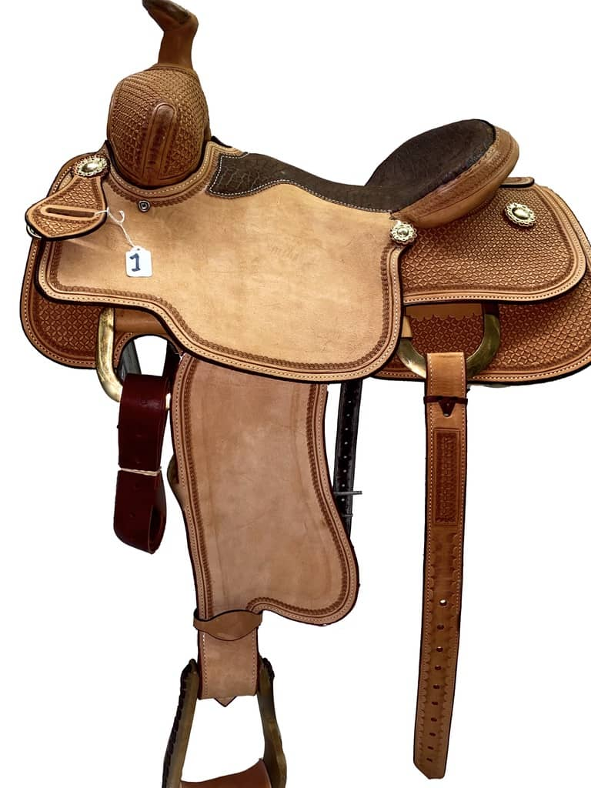

## True Leather Saddles

```markdown
If interested in a saddle or would like more pictures: 
  1.Mark down the code number (example: Saddle 1)
  2.Contact micpim@stanford.edu
```

### Saddle 1


### Saddle 2


### Saddle 3


### Saddle 4


### Saddle 5


### Saddle 6


### Saddle 7


### Saddle 8


### Saddle 9


### Saddle 10


### Saddle 11


### Saddle 12


### Saddle 13


### Saddle 14


### Saddle 15


### Saddle 16


### Saddle 17


### Saddle 18


### Saddle 19


### Saddle 20


### Saddle 21


### Saddle 22


### Saddle 23


### Saddle 24


